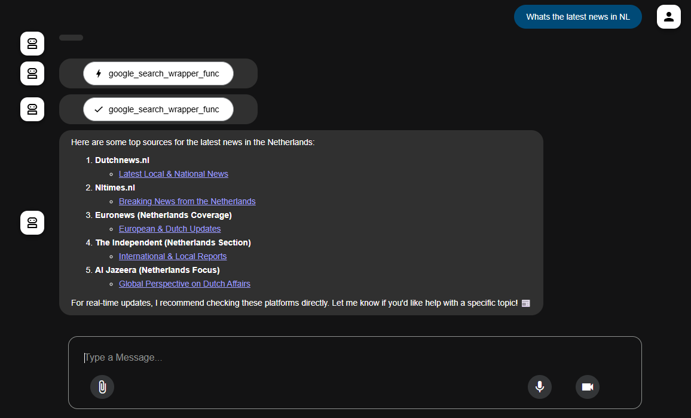

# Web Search Agent Setup Guide

This guide explains how to set up and run the Web Search Agent application.

## Setup local machine

### Prerequisites

Ensure you have the following installed on your local machine:

-   Python 3.8 or higher
-   Ollama (for local model serving)

### Install Python

If you don't have Python installed, you can download it from the [official Python website](https://www.python.org/downloads/).

Make sure to add Python to your system's PATH during installation.
You can verify the installation by running:

```bash
python --version
```

This should display the version of Python installed on your system.

### Install Ollama

Ollama is a local model serving tool. You can install it by following the instructions on the [Ollama website](https://ollama.com/download).

Once installed, you can verify the installation by running:

```bash
ollama --version
```

This should display the version of Ollama installed on your system.

## Setup the Web Search Agent

### Clone the Repository

Clone the repository to your local machine using the following command:

```bash
git clone https://github.com/KeesGeerligs/dbw-demo
```

### Install Python Dependencies

Navigate to the cloned repository directory:
```bash
# Create Virtual Environment
python -m venv .venv
```

Then activate the virtual environment:
```bash
# macOS/Linux
source .venv/bin/activate

# Windows CMD
.venv\Scripts\activate.bat

# Windows PowerShell
.venv\Scripts\Activate.ps1
```

Install the required Python packages using pip:

```bash
pip install -r requirements.txt
```

Validate the installation by running:

```bash
adk --help
```

This should display the available commands and options for the ADK (Agent Development Kit).


## Setting up the Web Search Agent with Ollama (Local Model)

> [!NOTE] 
> Lightweight: Mistral Small 3.1 can run on a single RTX 4090 or a Mac with 32GB RAM. This makes it a great fit for on-device use cases. If you don't have a powerful GPU or a Mac with 32GB RAM, you can host powerful models on the Nosana network (see below).

Next, pull the required language model via your terminal:
```bash
ollama pull mistral-small3.1
```

In the `web_search_agent_app/agent.py` file, set the `api_base_url` and `model_name_at_endpoint` variables to match your local Ollama setup:

```python
# Ollama local
api_base_url = "http://localhost:11434"
model_name_at_endpoint = "ollama_chat/mistral-small3.1"
```

Finally, run the agent application using the ADK web interface:
```bash
adk web
```

Once `adk web` is active, open your browser to the displayed URL `http://localhost:8000` to interact with the agent.

## Using a Non-Local Endpoint (Nosana)

Alternatively, you can use a non-local model endpoint by deploying the provided `job-definition.json` on the Nosana network.

1. Go to the [Nosana Dashboard](https://dashboard.nosana.com/deploy/) and connect your wallet with NOS tokens. Or swap some SOL tokens for NOS tokens on the left bottom corner of the dashboard after connecting your wallet.

2. Click on `Deploy Model` in the top left corner of the dashboard.

3. Press `Advanced Builder` Tab in order to deploy the [job-definition.json](./job-definition.json) file. This will provision a VLLM instance running the Qwen3-8B model.

4. Make sure to select the right GPU that fits your needs. Select `Advanced Search` in the GPU section and make sure to filter on `Linux`, `Cuda 2.8`. The `NVIDIA 4090` GPU is a good choice for the Qwen3-8B model, or choose a more powerful GPU if you want to run larger models or make the deployed model more performant.

5. Click on `Create Deployment`. You will be prompted to sign a transaction in your wallet. This will deploy the model on the Nosana network.

6. On the Deployment Page you will see the status of your deployment. See the logs output to see if deployment is still pending.

7. Once the deployment is finished, you will see a `Running` status. Click on the `View Services` button in order to see the `api endpoint URL`.

8. In [./web_search_agent_app/agent.py](./web_search_agent_app/agent.py), modify the `api_base_url` and `model_name_at_endpoint` variables to match your Nosana deployment:

    ```python
    # VLLM (example for Nosana)
    api_base_url = "YOUR_NOSANA_ENDPOINT_URL/v1" 
    model_name_at_endpoint = "openai/Qwen3-8B" # Or the specific model served by your job
    ```

    Ensure you also set the `api_key` if required by your endpoint (for Nosana's VLLM OpenAI-compatible endpoint, an API key is often not strictly needed but might be configurable).

9. Run the Agent:

After updating the agent configuration, run `adk web` as usual. The agent will now use your deployed Nosana endpoint.

This method allows you to use more powerful models without needing local GPU resources, leveraging the decentralized compute power of the Nosana network.

## Example Output

Here is an example of the agent in action:




